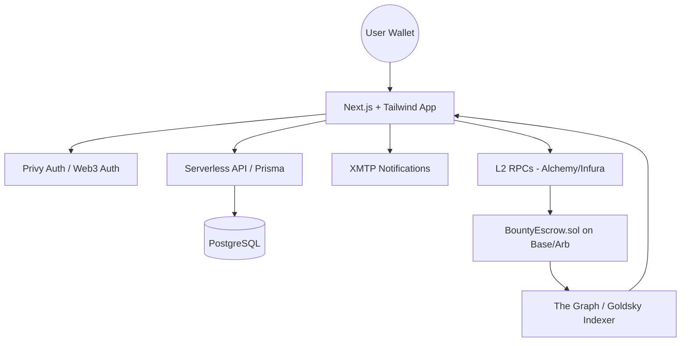

# EtherLancer Technical Blueprint

## 1. System Architecture


## 2. Database Schema (Prisma)
```prisma
model User {
  id             String      @id @default(uuid())
  address        String      @unique
  username       String?
  bio            String?
  role           UserRole    @default(TALENT)
  reputation     Int         @default(0)
  submissions    Submission[]
  listings       Listing[]   @relation("SponsorListings")
}

model Listing {
  id            String         @id @default(uuid())
  title         String
  description   String
  type          ListingType
  status        ListingStatus  @default(OPEN)
  rewardAmount  Float
  rewardToken   String
  network       String
  chainId       Int
  escrowAddress String?
  sponsorId     String
  sponsor       User           @relation("SponsorListings", fields: [sponsorId], references: [id])
  submissions   Submission[]
  createdAt     DateTime       @default(now())
}

model Submission {
  id          String   @id @default(uuid())
  listingId   String
  listing     Listing  @relation(fields: [listingId], references: [id])
  talentId    String
  talent      User     @relation(fields: [talentId], references: [id])
  content     String   // IPFS hash or markdown
  isWinner    Boolean  @default(false)
  nftTokenId  String?  // The reputation NFT minted on completion
}
```

## 3. Smart Contract Outline (Solidity)
```solidity
// SPDX-License-Identifier: MIT
pragma solidity ^0.8.20;

import "@openzeppelin/contracts/token/ERC20/IERC20.sol";
import "@openzeppelin/contracts/access/Ownable.sol";

contract BountyEscrow is Ownable {
    struct Bounty {
        address sponsor;
        address token;
        uint256 amount;
        bool active;
        bool paid;
    }

    mapping(bytes32 => Bounty) public bounties;

    function createBounty(bytes32 bountyId, address token, uint256 amount) external {
        IERC20(token).transferFrom(msg.sender, address(this), amount);
        bounties[bountyId] = Bounty(msg.sender, token, amount, true, false);
    }

    function releaseFunds(bytes32 bountyId, address winner) external {
        Bounty storage b = bounties[bountyId];
        require(msg.sender == b.sponsor || msg.sender == owner(), "Not auth");
        require(b.active && !b.paid, "Invalid state");
        
        b.paid = true;
        b.active = false;
        IERC20(b.token).transfer(winner, b.amount);
        // Logic to trigger Reputation NFT minting via Cross-Chain or local call
    }
}
```

## 4. Multi-Chain Strategy
- **Deployment**: Deploy the `BountyEscrow.sol` and `ReputationNFT.sol` on Ethereum Mainnet, Base, Arbitrum, and Optimism.
- **Unified Interface**: Use `wagmi`'s `useSwitchChain` to handle network changes based on the listing selected.
- **Cross-Chain Rep**: Use LayerZero or Chainlink CCIP to aggregate "Reputation Points" from multiple L2s back to a central registry on Base or Mainnet.
